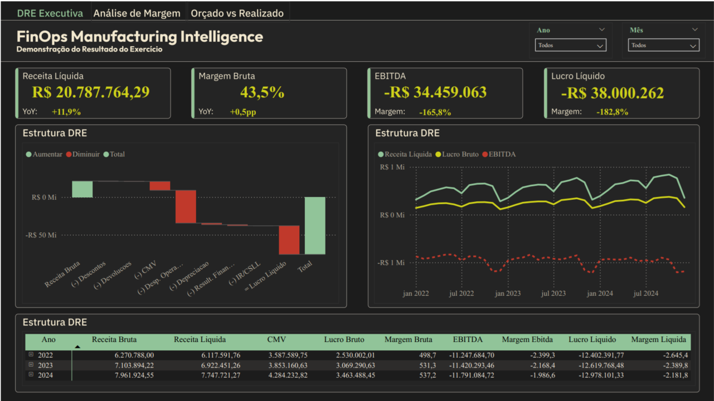
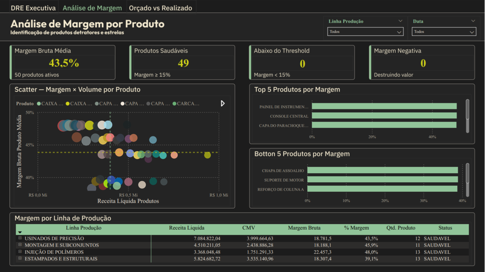
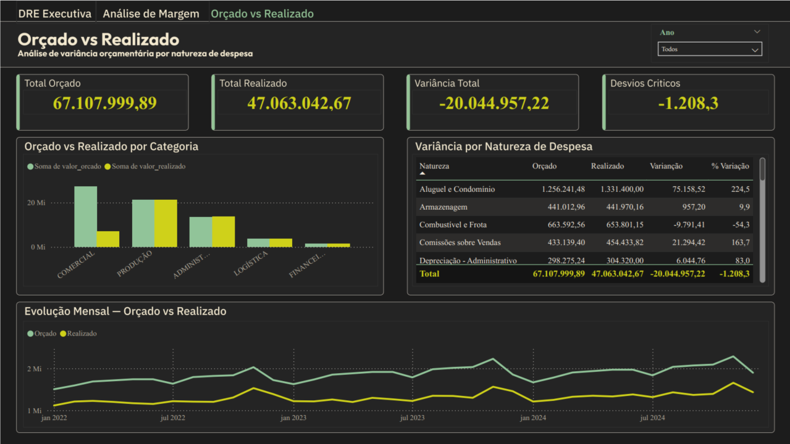

 

Mostrar Imagem
Mostrar Imagem
Mostrar Imagem
Mostrar Imagem
Mostrar Imagem
Mostrar Imagem
Mostrar Imagem

Mostrar Imagem
Mostrar Imagem
Mostrar Imagem

🔗 Acessar Dashboard no Power BI Service

🎯 O Problema
Uma indústria de autopeças Tier 2 — fornecedora direta de montadoras como Stellantis, Volkswagen e Toyota — operava com dados financeiros dispersos em diferentes sistemas: vendas, custos de produção, despesas operacionais e orçamento não se conversavam.
A diretoria financeira tomava decisões no escuro:

Quais produtos estão destruindo margem?
Onde estão os maiores desvios orçamentários?
Qual é a rentabilidade real da operação mês a mês?

A solução: pipeline de dados completo — da ingestão ao dashboard — unificando toda a operação financeira em uma DRE interativa, análise de margem por produto e controle orçado vs. realizado. Tudo atualizado automaticamente via Apache Airflow + dbt + BigQuery.
Público: CFO, CEO e equipe de Controladoria.

📊 Dados do Projeto
DimensãoDetalheOrigemDados sintéticos gerados via Python (Pandas + Faker)Período3 anos de operação — 2022 a 2024Transações de vendas~9.150 registrosRegistros de custos1.764Registros de despesas864Linhas de orçamento900Produtos50 autopeçasClientes24 (montadoras e Tier 1)Centros de custo14Histórico de custos (SCD Type 2)381 registrosÍndices de commodities144

⚠️ Dados 100% sintéticos, gerados para simular um cenário realista de indústria de autopeças Tier 2 no Brasil.

🏗️ Arquitetura — Pipeline Completo
Geração dos Dados (Python / Faker)
         ↓
[BRONZE]  Raw Data no BigQuery       ← Ingestão via Apache Airflow + Docker
         ↓
[SILVER]  Dados Limpos (dbt)         ← Tipagem, UPPER/TRIM, deduplicação, nulos
         ↓                              75 testes de qualidade automatizados
[GOLD]    Marts Analíticos (dbt)     ← 4 tabelas fato/mart + dimensões
         ↓
   Dashboard Power BI                ← Conectado ao BigQuery
Camada Gold — Modelo Dimensional
TabelaDescriçãomart_dre_mensalDRE completa mês a mês (receita bruta → lucro líquido)mart_margem_produtoMargem por produto com histórico via SCD Type 2mart_orcado_realizadoVariância orçado vs. realizado por natureza de despesamart_kpis_executivoKPIs consolidados para visão C-levelstg_produtosDimensão de 50 autopeças com linha de produçãostg_clientesDimensão de 24 clientes

📐 KPIs e Métricas
KPIPor que importaReceita LíquidaFaturamento real descontado devoluções e descontosMargem Bruta (%)Eficiência produtiva — saudável entre 35–50% para Tier 2EBITDACapacidade de geração de caixa operacionalLucro Líquido / Margem LíquidaSaúde financeira real após IR/CSLL (34%)Ticket MédioQueda indica mudança no mix ou pressão de preço das montadorasVariância Orçado vs. RealizadoFlag automático: >10% = alerta · >20% = críticoProdutos com Margem NegativaContagem de produtos que destroem valor — ação imediataEvolução MoM / YoYTendência eliminando efeito de sazonalidade (paradas dez/jan)

🖥️ Dashboard Power BI — 3 Páginas
Cada página responde uma pergunta estratégica do C-level:
Página 1 — DRE Executiva
"Como está a saúde financeira da empresa?"

KPI cards: Receita · Margem Bruta · EBITDA · Lucro Líquido
Waterfall chart da DRE — cascata de receita bruta até lucro líquido
Line chart com evolução mensal de 36 meses
Tabela DRE detalhada com conditional formatting

Página 2 — Análise de Margem
"Quais produtos estão destruindo ou gerando valor?"

Scatter plot margem × volume por produto (identifica estrelas e detratores)
Ranking horizontal Top 10 produtos por margem
Heatmap de margem por linha de produção × mês
KPI cards: margem média · produtos saudáveis · abaixo do threshold · margem negativa

Página 3 — Orçado vs. Realizado
"Onde o orçamento está fora de controle?"

Clustered bar chart comparativo por natureza de despesa
Tabela de variância com semáforo (OK / Alerta / Crítico)
Gauge charts de atingimento por categoria
Line chart evolução mensal orçado vs. realizado

💡 Principais Insights
Insight 1 — Crescimento de receita com lucro negativo: o problema está nas despesas
A empresa cresceu +11,9% em receita em 2024, com margem bruta saudável (~44,8%). Porém o lucro líquido foi negativo em R$ 12,9M. O problema não está nos produtos — está nas despesas operacionais, que consomem mais que o dobro do lucro bruto. Estrutura de custos fixos superdimensionada para o nível de faturamento atual.
📌 Auditoria nas naturezas com desvio orçamentário crítico — especialmente Manutenção Industrial (+20%) e Energia Elétrica (+15%).

Insight 2 — Sazonalidade severa derruba resultado em dezembro e janeiro
Paradas coletivas das montadoras causam queda de ~55% na receita em dez/jan, enquanto as despesas fixas permanecem constantes. Resultado: margem EBITDA de -336% a -418% nos piores meses do ano.
📌 Política de férias coletivas alinhada às paradas + contratos flexíveis de energia e manutenção para reduzir custo fixo nos meses de baixa.

Insight 3 — Estampados e Estruturais: a linha mais exposta a commodities
Dos 50 produtos, 49 têm margem saudável (≥15%) — nenhum com margem negativa. Porém a linha Estampados e Estruturais tem margem de 38,9%, contra 45,8% de Montagem e Subconjuntos — diferença de 6,9 pontos percentuais explicada pela maior exposição a aço e alumínio.
📌 Renegociação de contratos de matéria-prima ou implementação de hedge de commodities para proteger a margem nessa linha.

📸 Screenshots do Dashboard
Capa

Página 1 — DRE Executiva

Página 2 — Análise de Margem

Página 3 — Orçado vs. Realizado

🛠️ Stack Técnico
Visualização        →  Power BI Desktop
Data Warehouse      →  Google BigQuery (GCP)
Transformação       →  dbt (75 testes de qualidade automatizados)
Orquestração        →  Apache Airflow (Docker)
Infraestrutura      →  Docker + GCP
Geração de Dados    →  Python 3.11 · Pandas · Faker
Modelagem           →  Arquitetura Medallion (Bronze → Silver → Gold)
                       Modelo Dimensional (4 fatos/marts + 2 dimensões)
                       SCD Type 2 (histórico de custos)
📄 Para detalhes técnicos completos (DAGs do Airflow, modelos dbt, queries BigQuery, como executar), veja o TECHNICAL.md.

Thales Manetti · LinkedIn · Portfólio

